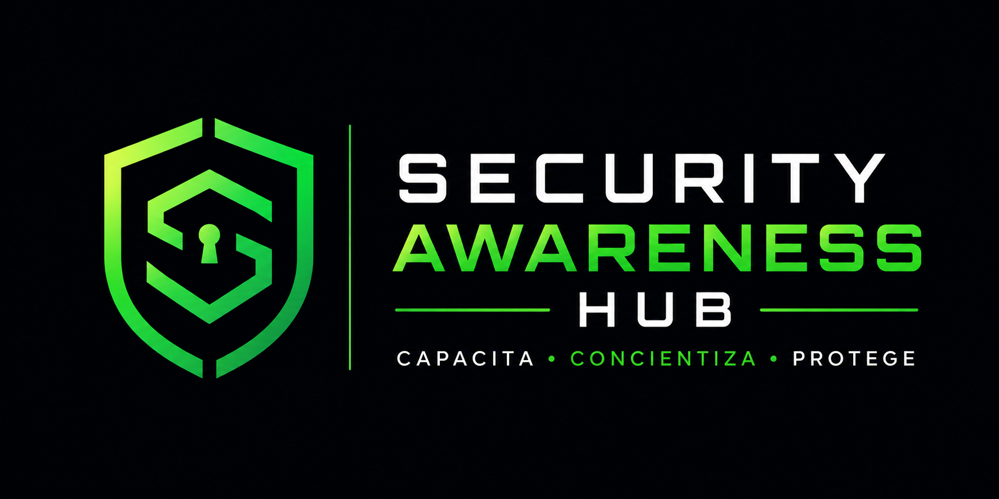

  

## 📌 Descripción

**Security Awareness Hub** es una plataforma web orientada a organizaciones que buscan fortalecer la cultura de ciberseguridad de sus colaboradores.

La plataforma nace como respuesta a la necesidad de mejorar la preparación de los empleados frente a amenazas digitales como **phishing, ingeniería social, malware, robo de credenciales y malas prácticas en el manejo de información**.

El proyecto busca centralizar los procesos de capacitación y concientización en ciberseguridad dentro de una organización, permitiendo gestionar usuarios, roles y contenidos educativos desde un mismo entorno.

Security Awareness Hub está diseñado para representar una solución aplicable a un entorno empresarial real, donde los administradores puedan gestionar la plataforma y los colaboradores puedan acceder a procesos de formación que les permitan identificar, prevenir y reportar posibles amenazas de seguridad.

La primera versión del proyecto estará enfocada en la construcción de un **MVP (Producto Mínimo Viable)** compuesto por las funcionalidades fundamentales de la plataforma:

- 🔐 Sistema de inicio de sesión.
- 🏢 Registro de empresas.
- 👤 Registro y gestión de usuarios.
- 🛡️ Gestión de roles y permisos.

Posteriormente, la plataforma podrá evolucionar con funcionalidades como cursos de capacitación, evaluaciones, reportes de phishing, estadísticas, seguimiento del progreso y generación de certificados.

> **Capacita · Concientiza · Protege**
